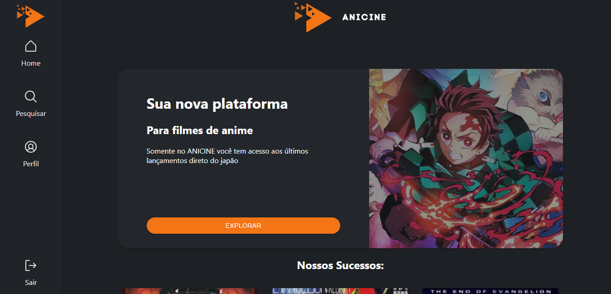

<h1 align="center"> Task 02 - React + Typescript </h1>

<p align="center">
  Task 02 realizada no módulo de React + Typescript do Vemser<br/>
</p>

<p align="center">
  <a href="#-tecnologias">Tecnologias</a>&nbsp;&nbsp;&nbsp;|&nbsp;&nbsp;&nbsp;
    <a href="#-instalacao-do-projeto">Instalação do projeto</a>&nbsp;&nbsp;&nbsp;|&nbsp;&nbsp;&nbsp;
  <a href="#-sobre-o-projeto">Sobre o Projeto</a>&nbsp;&nbsp;&nbsp;
</p>

<p align="center">
  
</p>

<p align="center">
  <a href="https://ignite-todo-silk.vercel.app/" target="_blank">➡️ Acesse o deploy!</a>
</p>

## 🚀 Tecnologias

Esse projeto foi desenvolvido com as seguintes tecnologias:

- ReactJs
- TypeScript
- Css

## ⚙️ Instalação do projeto

Passo-a-passo:

1. Comandos necessários para executar:

```
npm i
npm start
```

## 💻 Sobre o Projeto

O projeto é uma SPA simples, que consome uma API retornando Filmes de Animes, também é possível fazer requisições para a API via campo de busca na página "Pesquisar"

- Links do figma 

https://www.figma.com/file/xrt5VB2rxlydFuw9r3miFq/Untitled?type=design&node-id=0%3A1&mode=design&t=wrlSic4aFMogucov-1